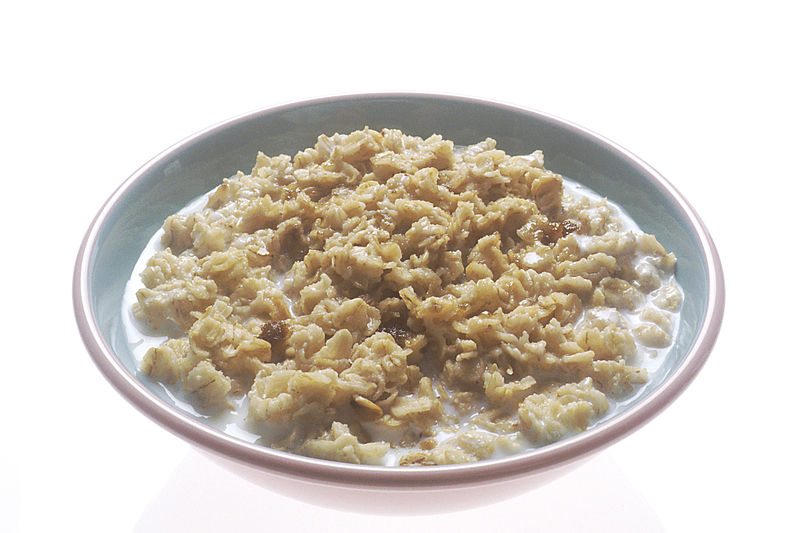

# Exporting to Markdown

The [`export`](../commands/export.md) command converts your YAML recipes into a more viewable Markdown format. The markdown recipes can be browsed from your phone / tablet in the kitchen. 

This is how the example recipe from [YAML recipe format](yaml.md) will look when exported to markdown: 

# Porridge

Author: Me

From: www.porridge.com

Servings: 1

Preparation: 1 minutes

Cooking: 5 minutes

Notes: easy peasy

## Equipment: 
- Small saucepan
- Stove

## Ingredients:
- [ ] 50 g oats
- [ ] 100 ml water
- [ ] Brown sugar

## Method:
1. Put the oats and water in the pan
2. Cook until the desired thickness is reached
3. Serve with some brown sugar to taste